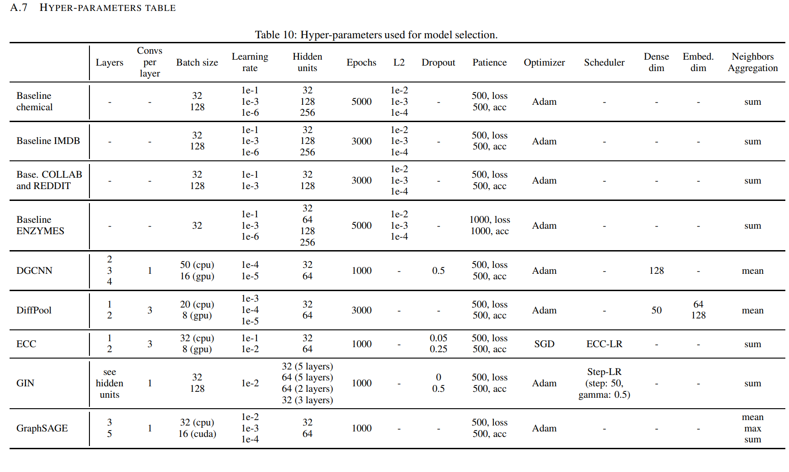
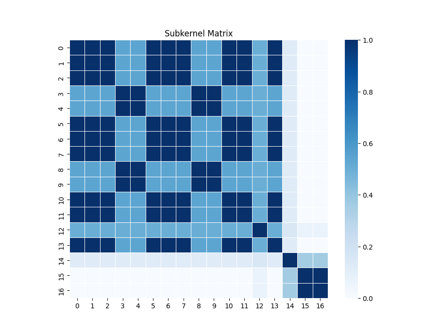
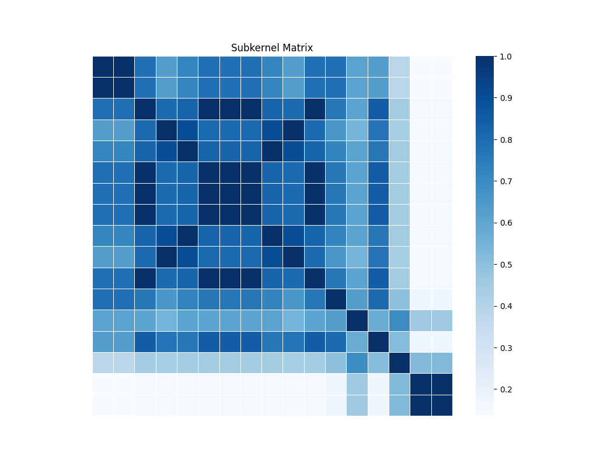
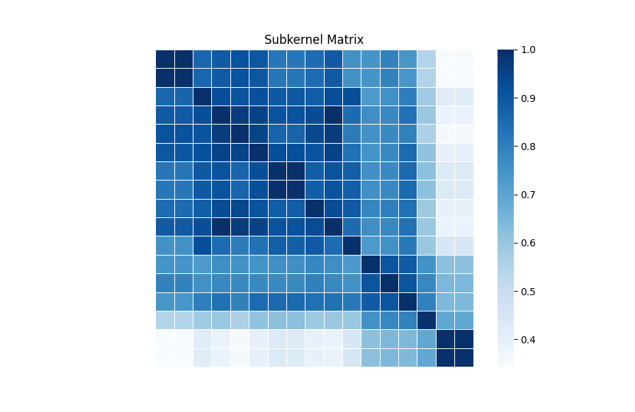
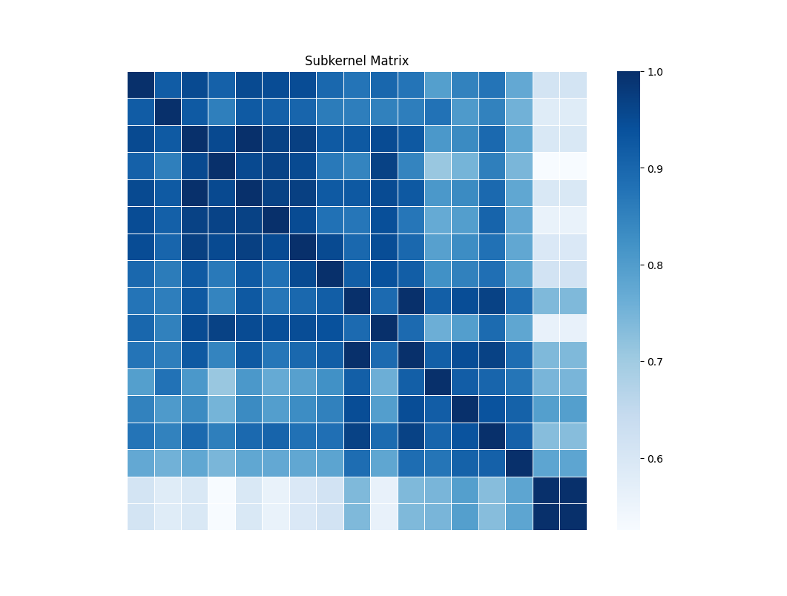
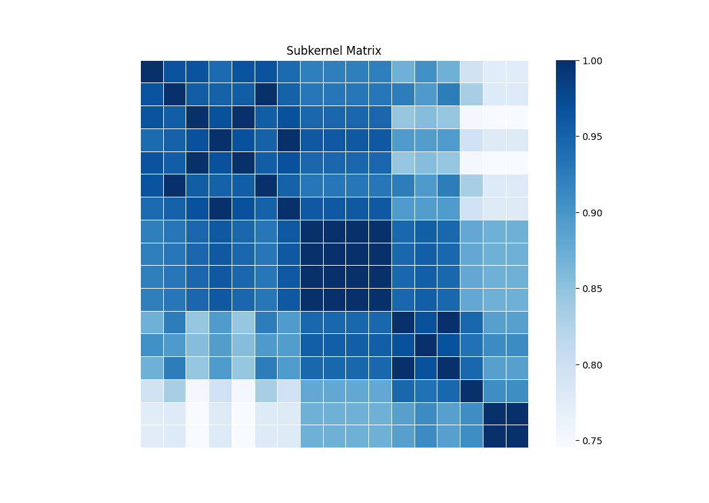

# The result of the experiments

## K-Fold only use train sets and validation sets
 The MUTAG dataset was used with 10-fold cross-validation. Using the method in sklearn, random_state is fixed to 1. The highest validation accuracy is extracted from each fold as the accuracy of that fold, and finally the model's accuracy is calculated by averaging.
## Update 2023/9/13
1. Do all the experiments on MUTAG, and create tables.  :fast_forward:
2. Using faster kernel. :fast_forward: 
3. Early stop
4. Trying different attentions.
5. Positional encoding
6. Multi head attention

## Grid Search Result with 200 Patience with best val loss(new folds)
| Method/Dataset | MUTAG | PTC | PROTEINS | NCI1 |
| :-----:| :------: | :------: | :----: | :---:|
| Ours |82.95+/-2.6| 54.40+/-2.7|73.67+/-1.3| | |
| Ours + k=3 |82.92+/-2.5|54.98+/-2.0 |74.22+/-1.2| | |
| Ours + k=4 |81.87+/-2.3|54.97+/-1.8 |73.58+/-1.3| | |
| Ours + k=5 |85.58+/-2.6|52.96+/-3.2|73.77+/-1.6| | |
| GCN|75.99+/-3.5| 56.11+/-2.8 |71.60+/-0.8 |74.53+/-0.7 | 
| DGCNN |85.03+/-2.7 |50.60+/-2.2 |73.86+/-0.7 |74.38+/-0.7 |
| DiffPool |81.35+/-2.5 |57.83+/-2.3 |71.25+/-1.5 |79.32+/-0.9 | 
| ECC |80.82+/-4.2 |50.87+/-2.8 |71.17+/-1.0 |75.82+/-0.5 |
| GIN |80.26+/-3.1 |58.69+/-1.6 |74.76+/-0.9 |78.89+/-0.6 |
| GraphSAGE |72.22+/-2.8 |55.78+/-2.7|71.25+/-1.5 |77.44+/-0.7 |
| Transformer |72.78+/-3.6 |51.74+/-2.0 |70.98+/-1.1 |65.67+/-0.7 |
| GraphiT + diffusion|81.46+/-2.6 |60.14+/-2.1 |74.21+/-1.2 |76.69+/-0.7 |
| GraphiT + adj |79.27+/-1.7 |57.84+/-2.5 |71.07+/-1.4 |77.96+/-0.7 |
| GraphiT + GCKN|81.93+/-2.2|59.91+/-3.2|||

## Average time cost
| Method/Dataset | MUTAG | PTC | PROTEINS | NCI1 |
| :-----:| :------: | :------: | :----: | :---:|
| Ours |(57.42+/-17.53)|() |()| | |
| Ours + k=3 || || | |
| Ours + k=4 || || | |
| Ours + k=5 |||| | |
| GCN|| | | | 
| DGCNN |40.33+/-5.7 |26.31+/-5.5 |87.97+/-10.06 |330.68+/-15.77 |
| DiffPool |17.52+/-2.9 |28.92+/-2.76|122.05+/-17.80 |324.19+/-42.07| 
| ECC |39.49+/-5.79 |57.13+/-3.54 |291.51+/-38.24 |1357.29+/-162.07 |
| GIN |12.72+/-1.57 |18.33+/-2.22 |67.39+/-8.02 |282.93+/-19.74 |
| GraphSAGE |14.86+/-2.31 |18.15+/-1.56|113.37+/-14.78 |331.66+/-40.91 |
| Transformer | || ||
| GraphiT + diffusion| || | |
| GraphiT + adj | | | | |
| GraphiT + GCKN|||||

### Our grid search
StepLR(optimizer, step_size=25, gamma=0.5)

lr:0.001

MUTAG:
StepLR(optimizer, step_size=50, gamma=0.5)

k:2/3/4/5

batch_size: 32/64

drop_out: 0/0.1

layer: 1/2/3/4/5/6

hop: 1/2/3/4/5

PTC:

k:3/4/5

batch_size: 32/64/128

drop_out: 0/0.1

layer: 1/2/3/4/5/6

hop: 1/2/3/4/5

PROTEINS:
Because of the limitation of GPU memory, We will not search 3,4 and 5 hop with k=4 and 5. 

k:3,4,5

batch_size: 32/64/128

drop_out: 0/0.1

layer: 1/2/3/4/5/6

hop: 1/2/3

NCI1:
k: 3, 4, 5

batch_size: 64/128

drop_out: 0/0.2

layer: 1/2/3

hop: 1/2/3/4/5

### GIN GRID SEARCH
same as the paper

## MUTAG 2023/9/13 
Bold plus italic is the highest accuracy, bold is the second highest, and italic is the third highest.

## train_val_test split
### WL_GPU Parallel and precomputing dictionary(k=3)
batch_size = 32

LR:0.001  StepLR(optimizer, step_size=25, gamma=0.5)

epochs:300 and get the best model from the last 50 epochs with the highest validation accuracy.
| Layers/Hops | 1 | 2 | 3 | 4 | 5 |
| :-----:| :------: | :------: | :----: | :---:| :---:|
| 1 |0.8889+/-0.0136 223s |0.8722+/-0.0158 221s |0.8389+/-0.0200 236s |0.8444+/-0.0219 224s |0.8556+/-0.0211 220s |
| 2 |0.8722+/-0.0158 297s |0.8500+/-0.0249 300s |0.8278+/-0.0214 300s |0.8556+/-0.0179 300s |0.8556+/-0.0225 300s |
| 3 |***0.9000+/-0.0189 403s*** |0.8389+/-0.0200 413s |0.8389+/-0.0214 413s |0.8333+/-0.0192 417s |0.8389+/-0.0183 424s |
| 4 |0.8500+/-0.0177 492s |0.8389+/-0.0183 483s |0.8278+/-0.0254 491s |0.8222+/-0.0172 488s |0.8389+/-0.0228 492s |
| 5 |0.8611+/-0.0226 577s |0.8389+/-0.0242 581s |0.8222+/-0.0172 584s |0.8611+/-0.0196 575s |0.8667+/-0.0179 586s |
| 6 |0.8389+/-0.0146 666s |0.8444+/-0.0189 664s |0.8333+/-0.0222 673s |0.8444+/-0.0219 673s |0.8611+/-0.0196 675s |
### WL_GPU Parallel and precomputing dictionary(k=4)
| Layers/Hops | 1 | 2 | 3 | 4 | 5 |
| :-----:| :------: | :------: | :----: | :---:| :---:|
| 1 | | | | | |
| 2 | | | | | |
| 3 | | | | | |
| 4 | | | | | |
| 5 | | | | | |
| 6 | | | | | |
### WL_GPU Parallel and precomputing dictionary(k=5)
| Layers/Hops | 1 | 2 | 3 | 4 | 5 |
| :-----:| :------: | :------: | :----: | :---:| :---:|
| 1 |0.8500+/-0.0137 |0.8278+/-0.0242 |0.8556+/-0.0179 |0.8444+/-0.0153 |0.8556+/-0.0211 |
| 2 |0.8667+/-0.0161 |0.8444+/-0.0258 |0.8389+/-0.0200 |0.8611+/-0.0196 |0.8611+/-0.0162 |
| 3 |0.8667+/-0.0161 |0.8444+/-0.0258 |0.8389+/-0.0200 |0.8444+/-0.0189 |0.8667+/-0.0117 |
| 4 |***0.8778+/-0.0153*** |0.8333+/-0.0245 |0.8500+/-0.0236 |0.8500+/-0.0158 |0.8722+/-0.0193 |
| 5 |0.8611+/-0.0118 |0.8389+/-0.0242 |0.8333+/-0.0222 |0.8444+/-0.0131 |0.8667+/-0.0161 |
| 6 |0.8556+/-0.0263 |0.8389+/-0.0228 |0.8278+/-0.0228 |0.8556+/-0.0179 |0.8556+/-0.0141 |

## PTC
### WL_GPU Parallel and  Kernel Precomputing dictionary(k=3)
batch_size = 32

LR:0.001  StepLR(optimizer, step_size=25, gamma=0.5)

epochs:300 and get the best model from the last 50 epochs with the highest validation accuracy.
| Layers/Hops | 1 | 2 | 3 | 4 | 5 |
| :-----:| :------: | :------: | :----: | :---:| :---:|
| 1 |0.6000+/-0.0260 431s |0.5941+/-0.0199 425s |0.5676+/-0.0294 423s |0.5912+/-0.0321 421s |0.5971+/-0.0212 425s |
| 2 |0.6059+/-0.0303 567s |0.5824+/-0.0203 569s |0.6059+/-0.0254 571s |0.5706+/-0.0247 572s |0.5588+/-0.0256 587s |
| 3 |0.5853+/-0.0218 725s |***0.6088+/-0.0177 730s*** |0.6000+/-0.0232 736s |0.5235+/-0.0252 730s |0.5353+/-0.0305 741s |
| 4 |0.5824+/-0.0238 882s |0.6000+/-0.0200 885s |0.5647+/-0.0235 887s |0.5324+/-0.0277 889s |0.5559+/-0.0292 879s |
| 5 |0.5912+/-0.0283 1014s|0.5529+/-0.0275 1044s|0.5588+/-0.0333 1044s|0.5794+/-0.0314 1038s|0.5794+/-0.0338 1041s|
| 6 |0.5441+/-0.0257 1192s|0.5706+/-0.0200 1195s|0.5441+/-0.0351 1219s|0.5206+/-0.0360 1195s|0.5735+/-0.0315 1201s|
### WL_GPU Parallel and  Kernel Precomputing dictionary(k=3)
batch_size = 64

LR:0.001  StepLR(optimizer, step_size=25, gamma=0.5)

epochs:300 and get the best model from the last 50 epochs with the highest validation accuracy.

| Layers/Hops | 1 | 2 | 3 | 4 | 5 |
| :-----:| :------: | :------: | :----: | :---:| :---:|
| 1 |0.5941+/-0.0231 |0.6000+/-0.0243 |0.5559+/-0.0193 |0.5647+/-0.0345 |0.5765+/-0.0356 |
| 2 |0.6088+/-0.0285 |0.6147+/-0.0255 |0.5765+/-0.0250 |0.5941+/-0.0207 |0.5824+/-0.0350 |
| 3 |0.5853+/-0.0244 |0.6088+/-0.0216 |0.6088+/-0.0239 |0.5794+/-0.0253 |0.5529+/-0.0256 |
| 4 |0.6235+/-0.0302 |0.5912+/-0.0141 |***0.6352+/-0.0309*** |0.6000+/-0.0167 |0.5735+/-0.0323 |
| 5 |0.5765+/-0.0139 |0.5882+/-0.0186 |0.6235+/-0.0238 |0.5765+/-0.0320 |0.5853+/-0.0290 |
| 6 |0.5971+/-0.0138 |0.5941+/-0.0249 |0.5824+/-0.0322 |0.5706+/-0.0317 |0.5588+/-0.0235 |
### WL_GPU Parallel and  Kernel Precomputing dictionary(k=3)
batch_size = 64

LR:0.001  StepLR(optimizer, step_size=25, gamma=0.5)

dropout = 0.1

epochs:300 and get the best model from the last 50 epochs with the highest validation accuracy.

| Layers/Hops | 1 | 2 | 3 | 4 | 5 |
| :-----:| :------: | :------: | :----: | :---:| :---:|
| 1 |0.6000+/-0.0254 |0.5941+/-0.0227 |***0.6147+/-0.0301*** |0.5853+/-0.0318 |0.5853+/-0.0258 |
| 2 |0.6000+/-0.0247 |0.5941+/-0.0180 |0.6088+/-0.0243 |0.5971+/-0.0309 |0.5912+/-0.0188 |
| 3 |0.6088+/-0.0257 |0.5824+/-0.0190 |0.5882+/-0.0239 |0.5941+/-0.0269 |0.5471+/-0.0338 |
| 4 |0.6029+/-0.0300 |0.5882+/-0.0246 |0.5735+/-0.0254 |0.5647+/-0.0296 |0.5735+/-0.0200 |
| 5 |0.5912+/-0.0347 |0.5941+/-0.0269 |0.5441+/-0.0274 |0.5647+/-0.0291 |0.5588+/-0.0308 |
| 6 |0.5676+/-0.0320 |0.5824+/-0.0320 |0.5794+/-0.0328 |0.5794+/-0.0390 |0.5647+/-0.0308 |

### WL_GPU Parallel and  Kernel Precomputing dictionary(k=5)
batch_size = 32

LR:0.001  StepLR(optimizer, step_size=25, gamma=0.5)

epochs:300 and get the best model from the last 50 epochs with the highest validation accuracy.

| Layers/Hops | 1 | 2 | 3 | 4 | 5 |
| :-----:| :------: | :------: | :----: | :---:| :---:|
| 1 |0.5971+/-0.0246 |***0.6235+/-0.0165*** |0.5765+/-0.0332 |0.5676+/-0.0346 |0.5882+/-0.0300 |
| 2 |0.5912+/-0.0271 |0.6147+/-0.0258 |0.5794+/-0.0167 |0.5647+/-0.0296 |0.5559+/-0.0333 |
| 3 |0.5912+/-0.0214 |0.6176+/-0.0224 |0.6000+/-0.0209 |0.6000+/-0.0341 |0.5735+/-0.0213 |
| 4 |0.6088+/-0.0322 |0.5971+/-0.0270 |0.5765+/-0.0232 |0.5912+/-0.0323 |0.5706+/-0.0298 |
| 5 |0.5971+/-0.0253 |0.5529+/-0.0269 |0.5353+/-0.0278 |0.5676+/-0.0386 |0.5559+/-0.0417 |
| 6 |0.5589+/-0.0195 |0.5941+/-0.0245 |0.5706+/-0.0145 |0.5559+/-0.0258 |0.5353+/-0.0266 |

## NCI1

### WL_GPU Parallel and  Kernel Precomputing dictionary(k=3)
batch_size = 128

LR:0.001  StepLR(optimizer, step_size=25, gamma=0.5)

epochs:300 and get the best model from the last 50 epochs with the highest validation accuracy.

| Layers/Hops | 1 | 2 | 3 | 4 | 5 |
| :-----:| :------: | :------: | :----: | :---:| :---:|
| 1 |***0.7292+/-0.0096 4275s*** |0.7234+/-0.0079 4335s | | | |
| 2 |0.7299+/-0.0111 5792s |0.7144+/-0.0079 5801s | | | |
| 3 |0.7075+/-0.0148 7127s |0.7027+/-0.0084 7112s | | | |
| 4 |0.6912+/-0.0137 8424s |0.7022+/-0.0106 8468s | | | |
| 5 |0.6803+/-0.0137 9825s |0.6732+/-0.0140 9912s | | | |
| 6 |0.6810+/-0.0164 11404s |0.6504+/-0.0242 11394s | | | |

## PROTEINS

### WL_GPU Parallel and Kernel Precomputing dictionary(k=3)
batch_size = 32

LR:0.001  StepLR(optimizer, step_size=25, gamma=0.5)

epochs:300 and get the best model from the last 50 epochs with the highest validation accuracy.

| Layers/Hops | 1 | 2 | 3 | 4 | 5 |
| :-----:| :------: | :------: | :----: | :---:| :---:|
| 1 |***0.7495+/-0.0137 1390s*** |0.7495+/-0.0127 1499s |0.7486+/-0.0137 1584 |0.7432+/-0.0148 1816s |0.7541+/-0.0135 1979s |
| 2 |0.7441+/-0.0128 1853s |0.7405+/-0.0106 1969s |0.7351+/-0.0100 2069s |0.7468+/-0.0133 2300s |0.7441+/-0.0126 2550s |
| 3 |0.7459+/-0.0139 2390s |0.7441+/-0.0124 2498s |0.7396+/-0.0105 2518s |0.7405+/-0.0142 2628s |0.7396+/-0.0133 2899s |
| 4 |0.7405+/-0.0129 2907s |0.7405+/-0.0124 2999s |0.7396+/-0.0112 2939s |0.7495+/-0.0163 3123s |0.7459+/-0.0143 3331s |
| 5 |0.7450+/-0.0121 3395s |0.7450+/-0.0138 3452s |0.7405+/-0.0135 3455s |0.7495+/-0.0138 3607s |0.7432+/-0.0139 3768s |
| 6 |0.7405+/-0.0118 3696s |0.7450+/-0.0127 3972s |0.7360+/-0.0150 3950s |0.7405+/-0.0139 4126s |0.7396+/-0.0133 4290s |
### WL_GPU Parallel and Kernel Precomputing dictionary(k=3)
batch_size = 64

LR:0.001  StepLR(optimizer, step_size=25, gamma=0.5)

epochs:300 and get the best model from the last 50 epochs with the highest validation accuracy.
| Layers/Hops | 1 | 2 | 3 | 4 | 5 |
| :-----:| :------: | :------: | :----: | :---:| :---:|
| 1 |0.7450+/-0.0120 1206s |0.7514+/-0.0136 1328s |0.7505+/-0.0129 1442s |0.7495+/-0.0128 1625s |0.7505+/-0.0129 1728s |
| 2 |0.7468+/-0.0110 1650s |0.7450+/-0.0100 1745s |0.7459+/-0.0117 1820s |0.7468+/-0.0134 2013s |0.7505+/-0.0127 2123s |
| 3 |0.7441+/-0.0136 1988s |0.7523+/-0.0114 2089s |0.7450+/-0.0121 2188s |***0.7514+/-0.0137 2412s*** |0.7523+/-0.0134 2562s |
| 4 |0.7405+/-0.0117 2378s |0.7459+/-0.0135 2499s |0.7369+/-0.0131 2644s |0.7450+/-0.0132 2705s |0.7459+/-0.0130 2842s |
| 5 |0.7414+/-0.0101 2728s |0.7477+/-0.0116 2846s |0.7468+/-0.0146 2950s |0.7441+/-0.0137 3145s |0.7486+/-0.0142 3251s |
| 6 |0.7360+/-0.0127 3265s |0.7523+/-0.0129 3412s |0.7459+/-0.0139 3497s |0.7459+/-0.0112 3689s |0.7459+/-0.0133 3850s |
### WL_GPU Parallel and Kernel Precomputing dictionary(k=3)
batch_size = 128

LR:0.001  StepLR(optimizer, step_size=25, gamma=0.5)

epochs:300 and get the best model from the last 50 epochs with the highest validation accuracy.
| Layers/Hops | 1 | 2 | 3 | 4 | 5 |
| :-----:| :------: | :------: | :----: | :---:| :---:|
| 1 |0.7522+/-0.0118 1114s |0.7541+/-0.0128 1218s |0.7477+/-0.0125 1317s |0.7486+/-0.0133 1447s |0.7495+/-0.0136 1513s |
| 2 |0.7495+/-0.0102 1478s |***0.7559+/-0.0118 1591s*** |0.7545+/-0.0127 1707s |0.7495+/-0.0141 1831s |0.7514+/-0.0133 1850s |
| 3 |0.7495+/-0.0123 1790s |0.7459+/-0.0121 1885s |0.7505+/-0.0123 2004s |07450+/-0.0132 2457s |0.7486+/-0.0123 2244s |
| 4 |0.7423+/-0.0116 2183s |0.7523+/-0.0129 2296s |0.7477+/-0.0141 2387s |0.7495+/-0.0129 2482s |0.7468+/-0.0143 2582s |
| 5 |0.7505+/-0.0118 2539s |0.7477+/-0.0129 2649s |0.7486+/-0.0137 2770s |0.7432+/-0.0140 2872s |0.7532+/-0.0134 2956s |
| 6 |0.7459+/-0.0116 2902s |0.7523+/-0.0140 3026s |0.7468+/-0.0135 3122s |0.7450+/-0.0137 3250s |0.7477+/-0.0137 3321s |

#### Extract subgraphs and subgraphs' kernel time
| Dataset/Hops | 1 | 2 | 3 | 4 | 5 |
| :-----:| :------: | :------: | :----: | :---:| :---:|
| MUTAG | 1.9s | 2.0s | 2.1s | 2.1s |2.2s |
| PTC | 2.3s | 2.5s | 2.5s | 2.6s | 2.7s |
| NCI1 | 22.0s | 25.9s | 28.5s| 30.4s | 32.4s |
| PROTEINS | 9.8s | 16.1s | 20.4s | 23.8s |24.2s |

#### GrahpiT time
| Dataset/Layers | 1 | 2 | 3 | 4 | 5 | 6 |
| :-----:| :------: | :------: | :----: | :---:| :---:|:---:|
| MUTAG |156s |226s |329s |392s |456s |532s|
| PROTEINS | | | | | |
| 3 | | | | | |
| 4 | | | | | |
| 5 | | | | | |
| 6 | | | | | |
## Reuslt template
| Layers/Hops | 1 | 2 | 3 | 4 | 5 |
| :-----:| :------: | :------: | :----: | :---:| :---:|
| 1 | | | | | |
| 2 | | | | | |
| 3 | | | | | |
| 4 | | | | | |
| 5 | | | | | |
| 6 | | | | | |

## Heatmap
### MUTAG

## WL_GPU document
The WL_GPU framework is divided into WL_Conv and WL. WL_Conv handles specific WL convolutions, while WL manages the entire multi-layered WL hashing process. When compared with the CPU-based method (GraKeL), enhancements in the GPU method improve computational efficiency. Datasets are batch-processed and integrated into the dataloader during training. In each WL iteration, Unique labels or colors within subgraphs are enumerated, and color histograms are extracted. Using torch_scatter, node labels aggregate neighboring labels. Nodes then receive a new "hash code" — a numerical representation of inherent and neighboring features, contrasting the string-based hashing in CPU methods. After multiple iterations, node labels produce subgraph-wide histograms, representing the subgraph's structure. By comparing these histograms, structural similarity between nodes is assessed. Despite the CPU's parallel capabilities, the GPU method offers superior memory and computational performance.

